<a href="https://jainam.xyz">

  </a>

<b>:zap:&nbsp;<a href='https://t.me/j_projects/6'>Bot status</a></b>

<a align="center"> 
  
<start>

| 🤖 Bot 🤖 | ⭐️ Status ⭐️ |
| :-: | :-: |
| [­](https://t.me/iTs_a_RoBot) | ✔️ |
| [Mail Bot](https://t.me/xmail_robot) | ✔️ |

`Updated last at ~ 17:52 18/02`

**Made with ❤️ via [BotStatus](https://github.com/jainamoswal/botstatus)**. 
<end>

  
<b>:standing_man: &nbsp;Contact me</b>
 

    
    
    
    
    
    
    
    

  
<b>:v: &nbsp;Support me</b>

   
  

     &nbsp;
     &nbsp;
     &nbsp;
    
    
  
 

  
<b>:gear: &nbsp;GitHub Statistics</b>
 

  

  
<a href="https://github.com/jainamoswal">

 
  <b>Visitor count</b> 
  
</a>

  

